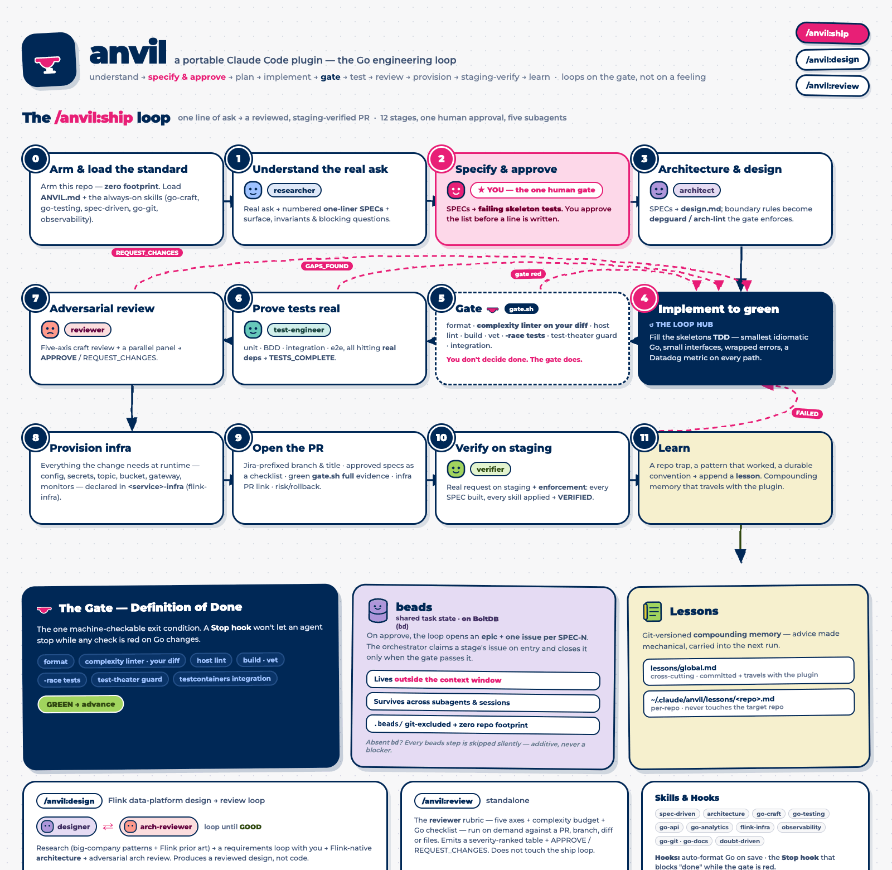

# anvil — intent-driven development for Go

**Set the specifications first. Leave anvil to meet them.**

anvil turns your intent into a short list of observable specifications. You
approve that contract before implementation begins; anvil then researches,
designs, builds, tests, reviews, and verifies the change until every
specification is met in a staging-verified pull request.

> You define what success means. anvil does the work—and proves the result.

[See the engineering standard](ANVIL.md) · [Use anvil with any agent](AGENTS.md)
· [Jump to install](#install)

## See intent-driven development in action

[](docs/anvil-architecture.png)

**The complete diagram lives directly in this README. Click or tap it to
[open the full-resolution version](docs/anvil-architecture.png) and read every
stage.**

The pink specification stage is the only human gate. Once you approve it, every
failed check, missing behavior, or review finding loops back into implementation
until the promised result is real.

## What makes anvil different?

Most agent workflows rely on good prompts and good intentions. anvil makes the
important parts enforceable:

- **You decide the intent.** Approve a short list of observable specifications
  before implementation starts.
- **anvil owns delivery.** Research, design, implement, test, review, provision,
  and verify the change.
- **The gate decides done.** Format, lint, build, vet, race-test, and reject test
  theater. Red means the work continues.

That creates a simple working relationship: **you decide what success means;
anvil meets the specifications and proves it.**

## Three ways to use it

### Ship a change

```text
/anvil:ship add a per-tenant rate limiter to the gateway middleware
```

anvil takes the request through understanding, specification, architecture, TDD
implementation, the mechanical gate, real-test review, adversarial code review,
infrastructure, PR creation, staging verification, and learning.

The loop asks for one approval only: the numbered specification list. After
that, it keeps moving until the checks are green or a genuinely human decision
is required.

### Design a system

```text
/anvil:design design an event pipeline for pricing analytics
```

Research proven industry patterns and Flink's existing platform, agree the
requirements once, then produce a Flink-native architecture and put it through
an adversarial review loop. The result is a reviewed design, not speculative
code. Add `--ship` when you want anvil to build it next.

### Review work on demand

```text
/anvil:review <PR | branch | files | diff>
```

Run the same five-axis review rubric independently of the shipping loop. It
returns severity-ranked findings and a clear `APPROVE` or `REQUEST_CHANGES`
verdict.

## The `/anvil:ship` promise

Every shipped change moves through the same four ideas:

1. **Make the intent explicit.** Research the real ask, turn it into one-line
   specifications, and get your approval before code is written.
2. **Build the smallest correct thing.** Design the boundaries, write failing
   tests first, and implement idiomatic Go until the gate turns green.
3. **Prove it is real.** Exercise real dependencies, run an adversarial review,
   and loop back on every gap instead of explaining it away.
4. **Verify the outcome.** Open a reviewable PR, declare the required
   infrastructure, exercise the change on staging, and preserve the lesson for
   the next run.

Heavy stages run in focused subagents and return compact artifacts, so the main
conversation stays clear. When `bd` is available, anvil also tracks the approved
specifications outside the context window and across sessions.

## The Definition of Done

The gate is portable Bash. Run it from the root of the Go repository you are
changing:

```sh
bash /path/to/anvil/scripts/gate.sh quick
bash /path/to/anvil/scripts/gate.sh full
```

`quick` is the fast, Docker-free inner loop. `full` adds the host test suite,
whole-repository race tests, and testcontainers integration.

Green means:

- formatting and imports are clean;
- new code stays within the strict complexity budget;
- the host repository's own lint and tests pass;
- the project builds and passes `go vet`;
- race-enabled tests pass;
- tests prove behavior instead of mocks proving themselves;
- integration tests use real dependencies.

You can run only anvil's floor when the host repository is not ready:

```sh
ANVIL_SOLO=1 bash /path/to/anvil/scripts/gate.sh quick
```

The complete contract and complexity limits live in [`ANVIL.md`](ANVIL.md).

## Install

### Claude Code

```sh
claude plugin marketplace add /path/to/anvil
claude plugin install anvil@anvil
```

The marketplace path can also be your GitHub remote. Once installed, start with
`/anvil:ship`, `/anvil:design`, or `/anvil:review`.

### Codex

Install this repository as the `anvil` plugin, then use the Codex-visible
skills:

```text
@anvil:ship add a per-tenant rate limiter
@anvil:design design an event pipeline for pricing analytics
```

Codex and other `AGENTS.md`-aware tools can also follow [`AGENTS.md`](AGENTS.md)
directly. It maps the plugin workflows to portable markdown instructions and the
same `gate.sh`, so the engineering standard does not depend on one agent
harness.

### Requirements

Required on `PATH`: `go`, `git`, and `gh`.

Optional tools unlock more of the loop: `golangci-lint`, `goimports`, Docker,
`kubectl`, `gcloud`, and `grpcurl`. anvil installs its pinned linter into
`~/.cache/anvil` when needed.

## Useful options

```text
--solo         use anvil's standard without the host repository's agent instructions
--no-staging   finish after the pull request and skip staging verification
--draft        open the pull request as a draft
--ticket       create a Jira ticket from the researched understanding
```

## Safe by default

Installing anvil globally does not make it take over every repository.
`/anvil:ship` arms the current repository automatically; you can also manage
that state yourself:

```sh
scripts/anvil-arm.sh arm
scripts/anvil-arm.sh status
scripts/anvil-arm.sh disarm
```

Use `touch ~/.claude/anvil/always-on` to arm every repository, or
`touch ~/.claude/anvil/off` as the global kill switch.

anvil keeps its orchestration state and per-repository lessons outside the
target repository. Your codebase gets the change, its tests, and its normal
project artifacts—not plugin clutter.

## What is inside?

- [`.claude-plugin/`](.claude-plugin) — plugin and marketplace manifests
- [`commands/`](commands) — the ship, design, and review workflows
- [`agents/`](agents) — focused researcher, architect, tester, reviewer, and
  verifier roles
- [`skills/`](skills) — specifications, architecture, Go craft, APIs,
  observability, infrastructure, documentation, and git
- [`hooks/`](hooks) — Go auto-formatting and the Stop gate
- [`scripts/`](scripts) — the portable gate, staging verification, and arming
- [`lessons/`](lessons) — Git-versioned, compounding engineering memory

The plugin is markdown, Bash, and JSON. The standard is visible, reviewable, and
portable—and the gate, not the agent, gets the final word.
